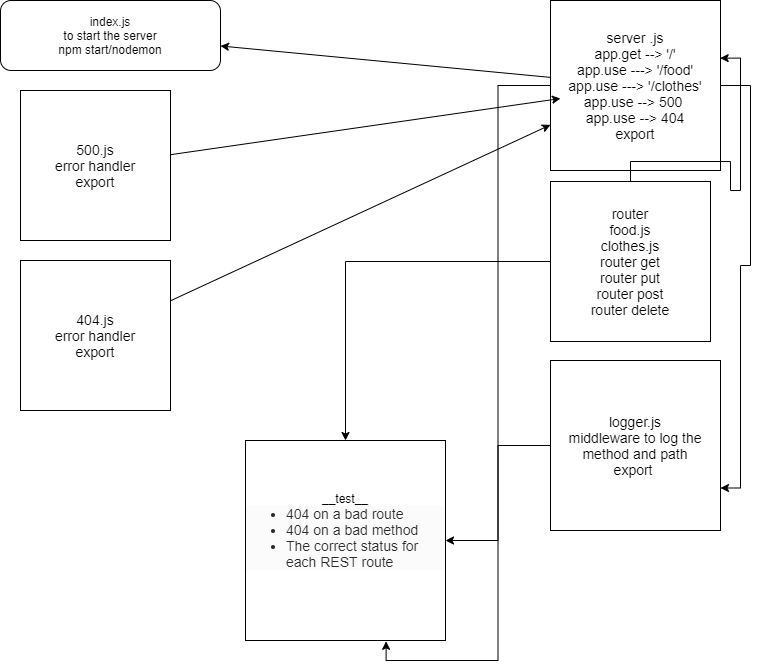

# api-server

## LAB - 04

### Author: Ibrahem Sarayrah

### LINKS

* [github action](https://github.com/IbrahemSarayrah/api-server/actions)

* [github action test](https://github.com/IbrahemSarayrah/api-server/runs/3362189515)

* [Local Test](uml-img/test-lab4-locally.PNG)

* HEROKU Prod : [https://ibrahem--api-server.herokuapp.com/](https://ibrahem--api-server.herokuapp.com/)

* pull request : [https://github.com/IbrahemSarayrah/api-server/pull/1](https://github.com/IbrahemSarayrah/api-server/pull/1)

### Setup

* **.env** requirements:
>
> PORT=3000
>
> POSTGRES_URI=postgres://localhost/lab04
>

### Running the app

* npm start / nodemon

* Endpoint: `/food`
* Endpoint: `/clothes`

* Returns Objects

```

{
    "clothesType": "shirt",
    "clothesColor": "black"
}

{
    "foodMeal": "pizza",
    "drink": "none",
    "totalPrice":"10"
}

```

### UML


